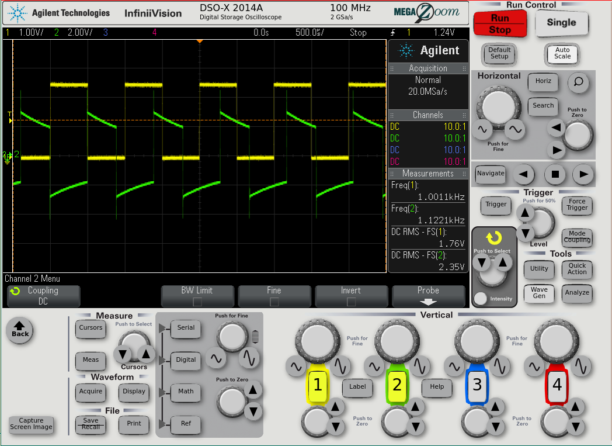

DSOXLAN
=======

This is a simple Ethernet interface-card for Agilent/Keysight
DSO-X 2000 and 3000 series oscilloscopes. The original Agilent/Keysight 
DSOXLAN module (about 326 euros + VAT as of December 2014)
also includes VGA output, while this simple card provides only LAN.

Many thanks to "georges80" on the EEVBlog forum
for the original schematic and PCB layout.

Components:
* Ethernet jack, WÜRTH 7499010121A
* 2pcs 220R 0805 resistor
* 1pcs 10R 0805 resistor
* 1pcs 100n 0805 capacitor

Files:
* Kicad: schematic, PCB, project, cmp, netlist
* non-standard footprints in /footprints: Ethernet magjack, 2x40-pin card-edge connector.

3D print components for case obtained from

https://www.eevblog.com/forum/projects/diy-dsoxlan-interface-for-keysight-oscilloscopes/msg4323214/#msg4323214

Apparently they have been authored by Jay_Diddy_B.

Released under the CERN OHL. See http://ohwr.org/cernohl

Images
======

Using the 3D printed front cover and spacers, the entire module looks like:

The oscilloscope features a built-in HTTP server.
The LAN settings page from the oscilloscope:

There are also options for remote control straight from the HTTP
server. Some of them require Java, but when selecting the "Tablet"
mode, it offers an HTML5 control option:

(Note: the above module has been built using a slightly different version
of the Würth RJ45 jack, 7499011121A. If anyone wants to use exactly
these, see https://github.com/dl8dtl/DSOXLAN/tree/WE7499011121A )

Links
=====
* https://web.archive.org/web/20200225205940/http://anagram.net/nuts/DSOXLAN/
* http://www.anderswallin.net/2014/12/diy-dsoxlan/
